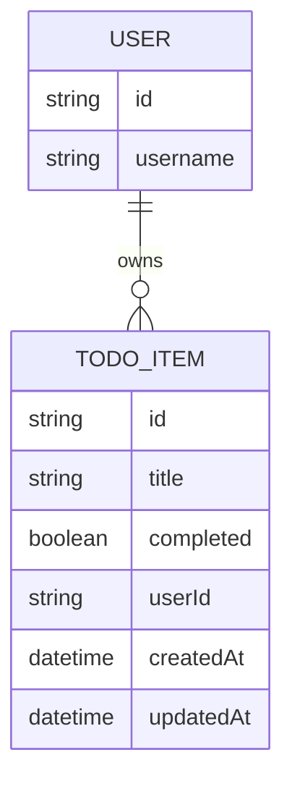

# Domain Model

The domain is small: each signed-in User owns a private list of TodoItems.

- `USER` is provisioned and authenticated by Thunder; `todo-api` never stores
a user profile, only the `userId` from the signed-in caller's token.
- `TODO_ITEM` belongs to exactly one `USER` via `userId`, and is only ever
read, edited or deleted by its owner.

