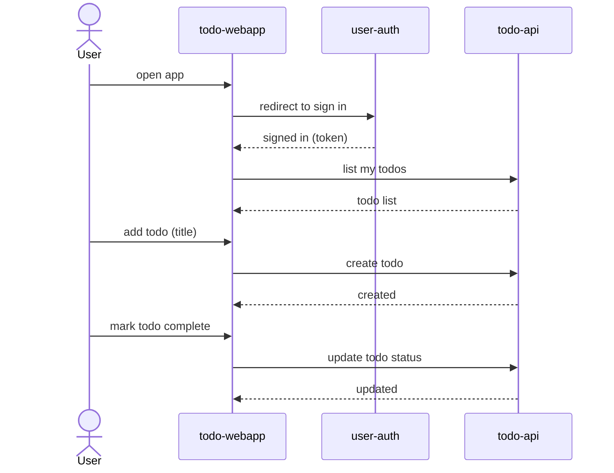

# Sign In and Manage Todos

A User signs in through Thunder and then manages their own private todo list.

```mermaid
sequenceDiagram
    actor User
    participant todowebapp as todo-webapp
    participant userauth as user-auth
    participant todoapi as todo-api

    User->>todowebapp: open app
    todowebapp->>userauth: redirect to sign in
    userauth-->>todowebapp: signed in (token)
    todowebapp->>todoapi: list my todos
    todoapi-->>todowebapp: todo list
    User->>todowebapp: add todo (title)
    todowebapp->>todoapi: create todo
    todoapi-->>todowebapp: created
    User->>todowebapp: mark todo complete
    todowebapp->>todoapi: update todo status
    todoapi-->>todowebapp: updated
```

